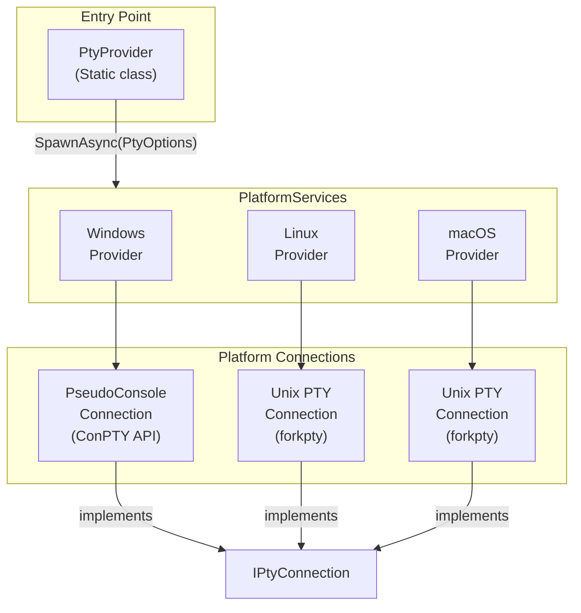

# Porta.Pty

A cross-platform pseudoterminal (PTY) library for .NET that enables spawning and interacting with terminal processes on Windows, Linux, and macOS.

[](https://github.com/tomlm/Porta.Pty/actions/workflows/build-windows.yml)
[](https://github.com/tomlm/Porta.Pty/actions/workflows/build-linux.yml)
[](https://github.com/tomlm/Porta.Pty/actions/workflows/build-macos.yml)
[](https://www.nuget.org/packages/Porta.Pty/) 
[](https://opensource.org/licenses/MIT)

## Features

- **Cross-Platform Support**: Works on Windows (using ConPTY), Linux, and macOS
- **Simple API**: Easy-to-use async API for spawning terminal processes
- **Full PTY Control**: Read/write streams, resize terminal, handle process exit events
- **Unicode Support**: Full UTF-8 support including complex characters
- **Native PTY Shim**: Includes a native C library to avoid .NET runtime permissioning issues with `fork()` on Linux/macOS
- **Out-of-band ConPTY**: On Windows, uses the `conpty.dll` + `OpenConsole.exe` implementation Windows
  Terminal ships, falling back to the in-box console host when it is unavailable
- **Native AOT**: Interop is source-generated, so the library works in a `PublishAot` application
- **.NET 10**: As of 2.0.0. Earlier versions targeted .NET Standard 2.0; see below

## Installation

Install via NuGet Package Manager:

```bash
dotnet add package Porta.Pty
```

Or via the Package Manager Console in Visual Studio:

```powershell
Install-Package Porta.Pty
```

### Upgrading to 2.0

**2.0.0 targets `net10.0`.** Earlier versions targeted .NET Standard 2.0 so one package could also serve
.NET Framework; that reach is gone, and it is the reason for the major bump rather than anything in the
API, which is unchanged.

The trade: netstandard2.0 pins C# 8 and puts most modern interop behind a polyfill or out of reach, and —
the part that mattered in this codebase — it meant the library was never *compiled* against the runtime
its consumers run on, in a repo whose POSIX shim exists precisely because a runtime version changed
behaviour underneath it (.NET 7 enabling W^X by default).

Nothing else is required of a consumer: no properties, no extra package references, and no
`RuntimeIdentifier`.

## Usage

### Basic Example

```csharp
using Porta.Pty;
using System.Text;

// Configure the terminal options
var options = new PtyOptions
{
    Name = "MyTerminal",
    Cols = 120,
    Rows = 30,
    Cwd = Environment.CurrentDirectory,
    App = RuntimeInformation.IsOSPlatform(OSPlatform.Windows) 
        ? Path.Combine(Environment.SystemDirectory, "cmd.exe") 
        : "/bin/bash",
    Environment = new Dictionary<string, string>
    {
        { "MY_VAR", "value" }
    }
};

// Spawn the terminal process
using IPtyConnection terminal = await PtyProvider.SpawnAsync(options, CancellationToken.None);

// Handle process exit
terminal.ProcessExited += (sender, e) => 
{
    Console.WriteLine($"Terminal exited with code: {e.ExitCode}");
};

// Write to the terminal
byte[] command = Encoding.UTF8.GetBytes("echo Hello World\r");
await terminal.WriterStream.WriteAsync(command, 0, command.Length);
await terminal.WriterStream.FlushAsync();

// Read from the terminal
byte[] buffer = new byte[4096];
int bytesRead = await terminal.ReaderStream.ReadAsync(buffer, 0, buffer.Length);
string output = Encoding.UTF8.GetString(buffer, 0, bytesRead);
Console.WriteLine(output);

// Resize the terminal
terminal.Resize(80, 24);
```

### PtyOptions Properties

| Property | Type | Description |
|----------|------|-------------|
| `Name` | `string?` | Optional terminal name |
| `Cols` | `int` | Initial number of columns |
| `Rows` | `int` | Initial number of rows |
| `Cwd` | `string` | Working directory for the process |
| `App` | `string` | Path to the executable to spawn |
| `CommandLine` | `string[]` | Unescaped argv tail; Porta serializes each argument for the target platform |
| `VerbatimCommandLine` | `bool` | Obsolete compatibility escape hatch for preformatted command-line fragments |
| `Environment` | `IDictionary<string, string>` | Environment variables (empty value removes the variable) |

### IPtyConnection Interface

| Member | Description |
|--------|-------------|
| `ReaderStream` | Stream for reading output from the terminal |
| `WriterStream` | Stream for writing input to the terminal |
| `Pid` | Process ID of the terminal process |
| `ExitCode` | Exit code (available after process exits) |
| `ProcessExited` | Event fired when the process exits |
| `Resize(cols, rows)` | Resize the terminal dimensions |
| `Kill()` | Immediately terminate the process |
| `WaitForExit(ms)` | Wait for process exit with timeout |

## Architecture



### Platform Implementations

#### Windows
- Uses the Windows **ConPTY (Pseudo Console)** API introduced in Windows 10 1809
- Leverages `CreatePseudoConsole`, `ResizePseudoConsole`, and `ClosePseudoConsole` native functions
- Process isolation via Windows Job Objects for clean process termination
- Implements proper cleanup order per Microsoft documentation
- Prefers the **out-of-band** ConPTY (`conpty.dll` + `OpenConsole.exe`) over the in-box one, and falls
  back rather than failing when it is absent — see [docs/conpty-out-of-band.md](docs/conpty-out-of-band.md)

#### Linux & macOS
- Uses **POSIX PTY** functions (`forkpty`, `openpty`) via a native C shim library
- Sets appropriate terminal environment variables (`TERM=xterm-256color`)
- Clears conflicting environment variables (TMUX, screen sessions)

### Native PTY Shim

On Linux and macOS, Porta.Pty includes a native C shim library (`libporta_pty`) that performs the `forkpty()` + `execvp()` sequence entirely in native code.

This is necessary because starting with .NET 7, the runtime enables **W^X (Write XOR Execute)** memory protection by default. W^X prevents memory pages from being both writable and executable simultaneously — a security hardening measure. This conflicts with `fork()` when running managed code in the forked child process, since the .NET runtime's JIT-compiled code and memory layout can violate the W^X invariant in the child.

By delegating the fork+exec to native C code, Porta.Pty avoids running any managed .NET code in the forked child process, completely eliminating the W^X conflict. The native shim libraries are bundled in the NuGet package for each supported platform (linux-x64, linux-arm64, osx-x64, osx-arm64) and are loaded automatically at runtime.

### Key Components

| Component | Description |
|-----------|-------------|
| `PtyProvider` | Static class providing the `SpawnAsync` entry point |
| `PtyOptions` | Configuration class for terminal spawning |
| `IPtyConnection` | Interface representing an active terminal connection |
| `IPtyProvider` | Internal interface implemented by platform-specific providers |
| `PlatformServices` | Platform detection and provider selection logic |

### Dependencies

- **Microsoft.Windows.CsWin32**: source-generates the Win32 P/Invoke. A build-time analyzer with
  `PrivateAssets="all"`, so it contributes nothing at run time and nothing to a consumer's graph — this
  replaced **Vanara.PInvoke.Kernel32**, which shipped a runtime assembly every consumer carried for about
  twenty entry points
- **Microsoft.Windows.Console.ConPTY**: `conpty.dll` and `OpenConsole.exe`, the out-of-band console host

Unix needs no managed interop package: the POSIX work happens in the native shim, so
**Mono.Posix.NETStandard** is gone too.

## License

This project is licensed under the MIT License - see the [LICENSE](LICENSE) file for details.

## Contributing

Contributions are welcome! Please feel free to submit a Pull Request.

### Testing on Windows ARM64

Run the test project directly for each architecture:

```powershell
dotnet test .\src\Porta.Pty.Tests\Porta.Pty.Tests.csproj --arch arm64
dotnet test .\src\Porta.Pty.Tests\Porta.Pty.Tests.csproj --arch x64
```

Running the x64 suite under emulation requires the .NET 10 x64 runtime in
addition to the native ARM64 runtime.

### Native AOT smoke test

Publish and run the AOT demo for the target Windows architecture:

```powershell
dotnet publish .\samples\Porta.Pty.AotDemo\Porta.Pty.AotDemo.csproj -c Release -r win-arm64
.\samples\Porta.Pty.AotDemo\bin\Release\net10.0\win-arm64\publish\Porta.Pty.AotDemo.exe
```

Replace `win-arm64` with `win-x64` to test the x64 executable. The demo verifies
that dynamic code is unavailable and completes a real PTY round trip.
